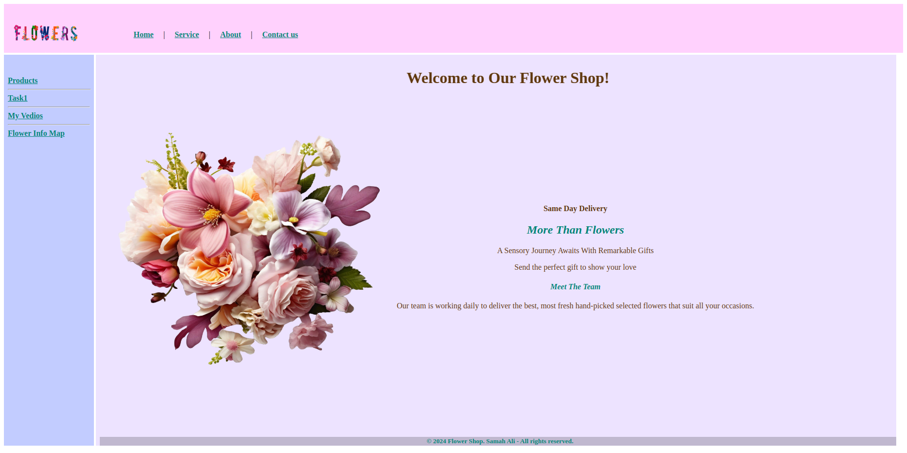

# Flower Shop

### Technologies and Techniques Used in This Assignment

- **Iframes**: Added a menu links in sidebar and in navbar that, when clicked, opens in a content iframe.
- **Contact-us: Here u will find background-image not good because we used background size 100% 100% 
- **Simple CSS**: Utilized straightforward CSS for styling.

- **Colors and Backgrounds**: Most of the CSS used involves setting colors, background colors, and background images without using shorthand.

### Project Overview

This project is a simple flower shop website designed to demonstrate the use of iframes and basic CSS styling. The website includes a menu that dynamically loads content into an iframe, providing a seamless user experience. The CSS is kept simple yet effective, focusing on colors and backgrounds to create an appealing visual design.

### Key Features

- **Dynamic Content Loading**: The menu allows users to navigate between different sections of the website by loading content into an iframe.
- **Basic Styling**: The CSS is straightforward, using colors and background properties to enhance the visual appeal of the website.

### Getting Started

To view the project, simply open the `index.html` file in your browser. The menu links will load the respective content into the iframe.

### Screenshots of Home page only

