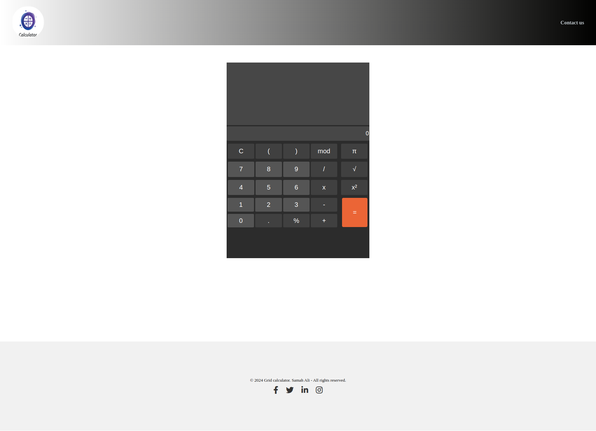

# Flex Calculator - README

This README provides instructions and details about the Flex Calculator project, including its purpose, structure, and setup.

## Project Overview

Flex Calculator is a responsive web-based calculator built with a modern flexbox layout. It features a sleek design and supports basic mathematical operations. The project is designed to be fully responsive and functional across various devices.

## Features

- Responsive design powered by CSS Flexbox, ensuring compatibility with various screen sizes (desktop, tablet, and mobile).
- Interactive UI with buttons for numbers, operators, and special mathematical functions.
- Stylish header and footer, including social media links.
- An intuitive layout with a separate input/output section is needed.

## File Structure

```
.
├── index.html                # Main HTML file for the calculator
├── assets
│   ├── css
│   │   └── style.css         # CSS file for styling the calculator
│   ├── images
│   │   └── vecteezy_calculator-logo.jpg # Logo for the calculator
└── README.md                 # Project documentation
```

## Prerequisites

- A modern web browser (e.g., Google Chrome, Firefox, Edge).
- No additional software or frameworks are required as the project uses pure HTML, CSS, and JavaScript (optional).

## Setup Instructions

1. **Clone the Repository:**
   ```bash
   git clone <repository-url>
   ```
2. **Navigate to the Project Directory:**
   ```bash
   cd grid-calculator
   ```
3. **Open the ****************`index.html`**************** file in your browser:**
   ```bash
   open index.html
   ```
   or simply double-click the `index.html` file in your file manager.

## Project Structure Details

### HTML (`index.html`)

- **Header:** Contains a logo and a "Contact us" link.
- **Main Section:** Includes the calculator layout with separate areas for inputs, outputs, and buttons.
- **Footer:** Displays copyright information and social media icons.

### CSS (`assets/css/style.css`)

- **Flexbox Layout:** Utilizes flexbox for a responsive and modern design.
- **Responsive Design:** Ensures the calculator adapts to different screen sizes using media queries.
- **Custom Styling:** Includes unique styles for the calculator buttons, input fields, and the header/footer.
- **Hover Effects:** Adds hover animations for buttons and social media icons.

## Usage

- **Input Numbers:** Use the numeric buttons (0-9) to input values.
- **Operators:** Use the operator buttons (+, -, ×, ÷, mod, etc.) to perform calculations.
- **Clear Input:** Use the `C` button to reset the input field.
- **Special Functions:** Utilize buttons like π and √ for mathematical constants and functions.
- **Calculate:** Press `=` to compute the result.

## Responsive Behavior

- The calculator's layout is powered by flexbox and resizes dynamically based on screen width:
  - Full width on smaller devices.
  - Proportional width adjustments for medium and large devices.

## Future Enhancements

- Add JavaScript functionality for interactive calculations.
- Include additional mathematical operations like trigonometric functions.
- Improve accessibility features (e.g., keyboard navigation).

## Credits

- **Developer:** Samah Ali
- **Logo Image:** [Vecteezy](https://www.vecteezy.com/)
- **Font Icons:** Font Awesome (via CDN)

## License

© 2024 Grid Calculator. All rights reserved.

## Contact

For queries or suggestions, reach out via the "Contact us" link in the header.


### Screenshot of calculator
