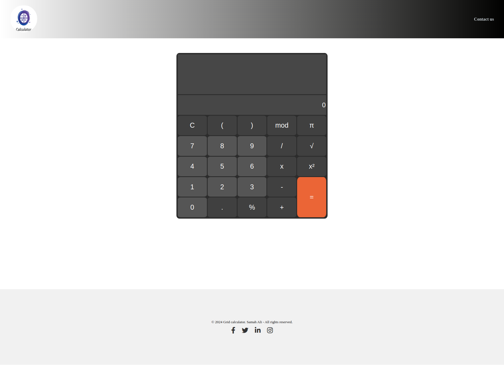

# Grid Calculator

## Overview
The **Grid Calculator** is a web-based calculator application featuring a sleek, modern design. It includes basic mathematical operations and advanced functionality such as modulo, square roots, and pi. The application is styled using CSS for responsiveness and uses HTML for structure.

---

## Features
- **Basic Operations**: Addition, subtraction, multiplication, division.
- **Advanced Operations**: Square, square root, modulo, and use of pi.
- **Clear Display**: Two separate areas for input and calculation results.
- **Responsive Design**: Adapts to different screen sizes for better usability.
- **Keyboard Interaction**: Styled buttons for clear functionality.
- **Footer with Social Links**: Includes links to social media platforms.

---

## File Structure
- **index.html**: Contains the HTML structure for the calculator.
- **assets/css/style.css**: Contains the main styles for the calculator layout and design.
- **assets/css/media-style.css**: Handles responsive designs for various screen sizes.
- **assets/images/**: Includes images such as the logo.

---

## How to Use
1. Clone or download the project.
2. Open `index.html` in any modern web browser.
3. Use the buttons on the calculator for various operations.
4. Navigate to the footer for contact details or to access social media links.

---

## Installation
No installation is required. Just download the project and open the `index.html` file in a browser.

---

## Folder Structure
```
project-folder/
├── assets/
│   ├── css/
│   │   ├── style.css
│   │   └── media-style.css
│   ├── images/
│   │   └── vecteezy_calculator-logo.jpg
├── index.html
```

---

## Styling Details
- **Primary Colors**:
  - Calculator background: `#2c2c2c`
  - Button hover: `gray`
  - Equal button: `#eb6536`

- **Responsive Design**: Utilizes `grid-template-areas` to manage button layout and ensure proper alignment across all screen sizes.

---

## Dependencies
- Font Awesome CDN for social media icons:
  ```html
  <link rel="stylesheet" href="https://cdnjs.cloudflare.com/ajax/libs/font-awesome/6.0.0-beta3/css/all.min.css">
  ```

---

## Credits
Designed and developed by **Samah Ali**. All rights reserved.

### Screenshot of calculator
